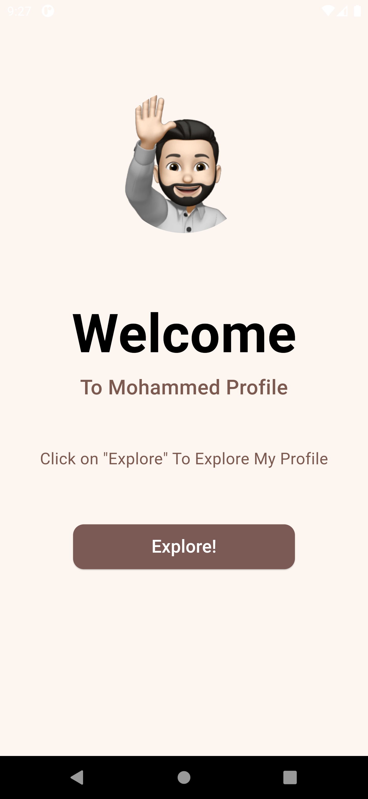
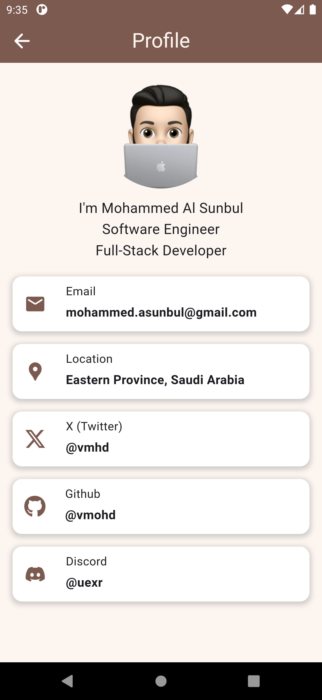

# My Profile App

  

## About My Profile
My Profile is a Simple Flutter App has a two pages that showcase my personal information and my Flutter development journey.
The project was developed as a part of the TechVerse "Application Development" bootcamp.

## Screenshots

  
  

## Getting Started

This project is a Simple Flutter application.

A few resources to get you started if this is your first Flutter project:

- [Lab: Write your first Flutter app](https://docs.flutter.dev/get-started/codelab)
- [Cookbook: Useful Flutter samples](https://docs.flutter.dev/cookbook)

For help getting started with Flutter development, view the
[online documentation](https://docs.flutter.dev/), which offers tutorials,
samples, guidance on mobile development, and a full API reference.
